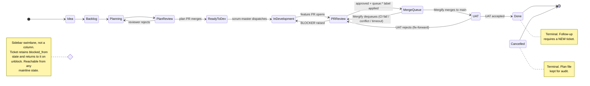

# Kanban states (jak-pipeline)

The pipeline tracks every unit of work through a 12-state machine. The board is the source of truth for ticket lifecycle; GitHub PR state and Mergify queue state are projections of it.

## States

The 12 states fall into three groups:

**Mainline (10 states, left-to-right):**

1. **Idea** — captured but not yet committed for delivery.
2. **Backlog** — committed for delivery; prioritised against other Backlog items but not yet started.
3. **Planning** — a planner agent is authoring (or refining) the plan file.
4. **Plan Review** — plan PR is open; plan-reviewer is judging it; user is the merger.
5. **Ready to Dev** — plan PR has merged; plan is approved and unclaimed; scrum-master can dispatch.
6. **In Development** — a dev-agent is implementing the plan in a worktree.
7. **PR Review** — feature PR is open; pr-reviewer (and any required human reviewers) are evaluating.
8. **Merge Queue** — feature PR has been queued by Mergify; awaiting batch CI + merge.
9. **UAT** — merged to main; running on a per-PR or per-deploy UAT environment for human acceptance.
10. **Done** — accepted in UAT and (where applicable) released. Terminal, but a follow-up is filed as a NEW ticket — never re-opened.

**Sidebar swimlane (1 state):**

11. **Blocked** — work cannot progress because of an external dependency (waiting on a vendor, missing decision, broken upstream service). Rendered as a sidebar swimlane next to whichever mainline column the ticket left, NOT as a column in the main flow. Carries a blocker reason and a blocker-since timestamp. When the block clears, the ticket returns to the column it left from.

**Terminal (1 state):**

12. **Cancelled** — the work will not be done. Terminal. The plan file (if one was authored) stays in the repo for audit but is marked cancelled in the board. Re-doing the work requires a new ticket and a new plan.

## Forward edges

- `Idea → Backlog` — committed for delivery.
- `Backlog → Planning` — a planner agent has been dispatched.
- `Planning → Plan Review` — plan PR has been opened.
- `Plan Review → Ready to Dev` — plan PR has merged (the merge IS the approval signal).
- `Ready to Dev → In Development` — scrum-master has dispatched a dev-agent against the plan.
- `In Development → PR Review` — feature PR has been opened.
- `PR Review → Merge Queue` — pr-reviewer + required reviewers have approved AND `queue:*` label has been applied by an authorised actor.
- `Merge Queue → UAT` — Mergify has merged the PR to main.
- `UAT → Done` — UAT has been accepted by the Owner.

## Backward edges

These are the explicit recovery paths the pipeline supports:

- `Plan Review → Planning` — plan-reviewer or the user has rejected the plan; planner re-opens to revise. The plan PR may be force-pushed or replaced by a `<slug>-v2.md` plan file (per the plans-are-immutable rule). The ticket returns to Planning until a fresh plan PR is opened.
- `PR Review → In Development` — pr-reviewer raised a BLOCKER OR the dev-agent is still pushing fixes. The PR stays open but the ticket reverts to In Development until the BLOCKER is resolved (either fixed in code or rebutted via `Not real:` reply + reviewer re-run).
- `Merge Queue → PR Review` — Mergify dequeued the PR (CI failure inside the queue, conflict, or queue-time-out). The `queue:*` label is removed; the ticket returns to PR Review for diagnosis and re-queuing.
- `UAT → PR Review` — UAT rejected the change. The merge to main is NOT reverted automatically; instead a fix-forward PR is required. The original ticket returns to PR Review (against a new fix-forward branch) and the original feature PR — already merged — stays in the history.

There are NO other backward edges. Specifically: Done is terminal (re-entry requires a new ticket), Cancelled is terminal, Backlog → Idea is not supported (de-prioritising stays in Backlog with a low priority).

## Blocked semantics

- Blocked is a SIDEBAR SWIMLANE, not a column.
- A ticket in Blocked retains its previous mainline state as `blocked_from`.
- When unblocked, the ticket returns to `blocked_from` — the pipeline does not skip forward.
- Blocked state has two required fields: `blocker_reason` (free text) and `blocked_since` (ISO 8601 timestamp). The Owner JQL filter surfaces tickets blocked > 48h.

## Cancelled semantics

- Terminal. Cannot transition out of Cancelled.
- The plan file (if authored) is kept in the repo with a `status: cancelled` frontmatter update; the file is never deleted (audit).
- Re-doing the work requires filing a NEW ticket; the cancelled ticket is never reopened.

## Re-entry rule for Done

Done is terminal. To do follow-up work on the same feature (a tweak, a regression fix, a v2), file a NEW ticket linked to the original via the `relates-to` link type. This keeps the lead-time / cycle-time metrics on the board honest — a Done ticket that re-opens months later distorts every chart.

## State diagram

## Per-state actor + automation map

| State           | Primary actor       | Automation                                                                  |
| --------------- | ------------------- | --------------------------------------------------------------------------- |
| Idea            | Owner               | none                                                                        |
| Backlog         | Owner               | none                                                                        |
| Planning        | planner agent       | dispatched via Agent tool with brief                                        |
| Plan Review     | plan-reviewer agent | dispatched by planner after PR open                                         |
| Ready to Dev    | scrum-master         | `/scrum-master` surfaces approved+unclaimed plans                       |
| In Development  | dev-agent           | spawned headless `claude -p` by `dispatch.sh` in a worktree                 |
| PR Review       | pr-reviewer agent   | dispatched by dev-agent on feature PR; human reviewers add approvals        |
| Merge Queue     | Mergify             | label-driven (`queue:*` applied by authorised agent only)                   |
| UAT             | Owner + UAT runner  | per-strategy (Cloudflare preview / local-docker / staging / production-gate)|
| Done            | Owner               | none                                                                        |
| Blocked         | Owner               | manual; surfaced by Owner JQL filter                                        |
| Cancelled       | Owner               | manual                                                                      |
